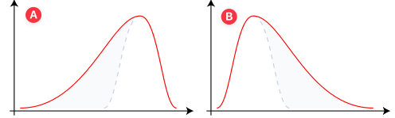
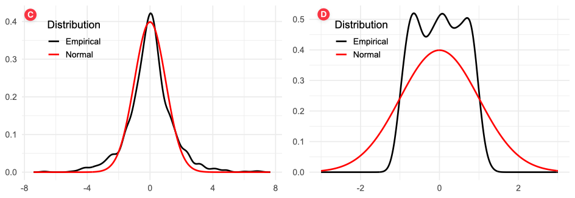

```{r setup, include=FALSE}
library(knitr)
library(kableExtra)
library(tidyverse)
library(huxtable)

# don't show code unless we explicitly set echo = TRUE
opts_chunk$set(echo = TRUE, message=FALSE, fig.align="center", fig.pos = "H")
opts <- options(knitr.kable.NA = "")

## control long outputs by using eg `max.lines = 10`
hook_output_default <- knitr::knit_hooks$get('output')
truncate_to_lines <- function(x, n) {
   if (!is.null(n)) {
      x = unlist(stringr::str_split(x, '\n'))
      if (length(x) > n) {
         # truncate the output
         x = c(head(x, n), '...\n')
      }
      x = paste(x, collapse = '\n') # paste first n lines together
   }
   x
}
knitr::knit_hooks$set(output = function(x, options) {
   max.lines <- options$max.lines
   x <- truncate_to_lines(x, max.lines)
   hook_output_default(x, options)
})
```

```{r xaringanExtra-extension, echo=FALSE}
# add search box
xaringanExtra::use_search(show_icon = TRUE, position = "bottom-left")
# enable tile view
xaringanExtra::use_tile_view()
```


class: inverse, center, middle

# Agenda

---

class: center-v

- Return Concepts
  - Review of Single Period Returns
  - Annualized Return
  - Cumulative Return
  - Average Return

- Risk Measures
  - Volatility
  - Skewness and Kurtosis
  - Downside Risk Measures

- Portfolio Performance Evaluation
  - Risk-adjusted Return
  - CAPM-related Metrics

---
class: inverse, center, middle
# Return Concepts 

---
.tight-top.tight-bottom[
## Review of Single Period Returns
]

- **Simple Return**: $r_t$ measures the rate of return from $t-1$ to $t$. 
  $$\red{r_t} = \frac{P_t-P_{t-1}}{P_{t-1}} = \frac{P_t}{P_{t-1}}-1$$
  
  One commonly used equality is
  $$P_t = P_{t-1} (1+r_t)$$

  For a bank deposit account, the quoted interest rate often refers to as "simple interest" which ignores compounding.

- **Log Return**: $R_t$ is the continuously compounded return from $t-1$ to $t$. It is the first difference of the natural logarithm of prices.
  $$\red{z_t} = \ln P_t - \ln P_{t-1} = \ln \frac{P_t}{P_{t-1}}$$

- **Relationship**: 
  For small returns, $r_t \approx z_t$. For larger returns, the difference becomes more significant. The relationship between simple and log returns is given by:
  $$\red{z_t = \ln (1+r_t)}$$

???
For example, an interest rate of $5\%$ payable every six months will be quoted as a simple interest of $10\%$ per annum in the market.

---

### APR vs AER

- **Annual Percentage Rate (APR)**: The APR is the simple interest rate that does not account for compounding within the year. It is calculated as:
  $$\text{APR} = r \times m$$
  where $r$ is the single period interest rate and $m$ is the number of compounding periods per year.

- **Annual Effective Rate (AER)**: The AER accounts for compounding and represents the actual annual return on an investment. It is calculated as:
  $$\text{AER} = (1 + r)^m - 1$$

---
class: example-block

## Lena's APR/AER question

Lena sees an offer: APR = 18% with monthly compounding. She wants to understand what this means in terms of her actual monthly cost and her effective annual cost.

- What is the monthly interest rate?
- What is the AER?

---
class: example-block

## Aaron's bank comparison

Two banks try to win over Aaron:

- Bank A advertises APR 12% with monthly compounding.
- Bank B advertises APR 12% with quarterly compounding.

Aaron asks you: Which bank truly gives him a better annual return?

---
class: example-block

## Bank Deposit Scenarios

Emma just received $100 as a gift and wants to put it in a bank. The bank advertises an **Annual Percentage Rate (APR) of 10%**. She wonders how much money she will have after one year depending on how interest is calculated.  

Calculate the final amount after one year under each of the following scenarios:

(a) The bank applies a **simple annual return**  
(b) The bank **compounds interest semi-annually** (twice per year)  
(c) The bank **compounds interest monthly**  
(d) The bank **compounds interest daily**  
(e) The bank **uses continuous compounding**  

Hint: Use the following formula
$$D_t = D_0 \left(1+\frac{R}{n}\right)^{nt}$$
where $D_0$ is the initial deposit, $D_t$ is the the value of the deposit at time $t$, $R$ is the APR, $n$ is the number of compounding periods per year, and $t$ is the number of years.

---
## Multiperiod Returns

- For simple returns, the cumulative return from time $0$ to time $T$ is given by:
  $$r_{0:T} = \Pi_{t=1}^T (1+r_t) -1.$$
  where $r_t$ is the simple return at time $t$.

- For log returns, 
  $$z_{0:T} = \sum_{t=1}^T z_t.$$
  where $z_t$ is the log return at time $t$.

- Relationship:
  $$1 + r_{0:T} = e^{z_{0:T}}$$

---
## Tracking Investment Performance Across Periods

Alex is tracking the performance of his investment over three consecutive periods. The returns for each period are as follows:

- Period 1: 2% simple return  
- Period 2: $-1$% simple return  
- Period 3: 3% simple return  

(a) Calculate the **cumulative simple return** from period 0 to period 3.  
(b) Calculate the log return for each period.  
(c) Calculate the **cumulative log return** from period 0 to period 3.  
(d) Verify the relationship between the cumulative simple return and cumulative log return.

---
## Average Return

Given a series of portfolio returns $r_{p,t}$, $t=1,2,\ldots,T$, the average return can be calculated in two ways:

- **Arithmetic mean** (AM) portfolio return
  $$\text{Arithmetic } \bar{r}_{p, 0:T} = \frac{\sum_{t=1}^T r_{p,t}}{T}$$

- **Geometric mean** (GM) portfolio return
  $$\text{Geometric } \bar{r}_{p, 0:T} = \left[\prod_{t=1}^T (1+r_{p,t}) \right] ^{\frac{1}{T}}-1$$

---
class: example-block
## Geometric Mean Better Captures Investment Performance

Sarah invests $100 in a fund for two months. In the **first month**, her investment grows by 10%, but in the **second month**, it loses 10%.

(a) What is the arithmetic average return? What does it suggest about the change in her $100 investment?

(b) What is the actual value of her investment after two months?

(c) What is the geometric return?

(d) Why does the geometric return provide a better measure of Sarah’s investment performance compared to the arithmetic average?

---

class: inverse, center, middle
# Risk Measures

---
## Volatility

The standard deviation of returns is usually called volatility.

$$\begin{aligned}
\text{Variance}: \sigma_p^2 &= \frac{1}{T-1} \sum_{t=1}^T (r_{p,t}-\bar{r}_p)^2 \\
\text{Volatility}: \sigma_p &= \sqrt{\sigma_p^2} \\
\text{Annualized Volatility}: \sigma_{p}^A &= \red{\sqrt{12}} \sigma_p \\
\end{aligned}$$

where we assume monthly portfolio returns $r_{p,t}$, $t=1,2,\ldots,T$.

---
class: example-block
## Calculating Portfolio Risk
Daniel is tracking his portfolio’s performance over the past 7 months. The monthly returns (in decimals) are:
$$[2\%,\; -1\%,\; 3\%,\; 0\%,\; -2\%,\; 1\%,\; 1.5\%]$$
He wants to understand how risky his portfolio is by calculating volatility and annualized volatility.

(a) Calculate the average monthly return.  
(b) Calculate the monthly volatility.  
(c) Calculate the annualized volatility.  

---
## Skewness and Kurtosis

- Skewness measures the asymmetry of the return distribution around its mean. It is the third (normalized) moment about the mean.
  - Positive skewness indicates a distribution with an asymmetric tail extending towards more positive values.
  - Negative skewness indicates a distribution with an asymmetric tail extending towards more negative values.

- Kurtosis measures the "tailedness" of the return distribution. It is the fourth (normalized) moment about the mean.
  - Kurtosis greater than 3 indicates a distribution with heavier tails than a normal distribution.
  - Kurtosis less than 3 indicates a distribution with lighter tails than a normal distribution.

---
class: example-block

## Recognize the Distribution Shape

.pull-left[
Which of the following distributions has 

- positive skewness, 
- negative skewness, 
- high kurtosis, and
- low kurtosis?
]

.pull-right[
<br>

]


---

## Downside Risk Measures

When the return distribution is asymmetric (skewed), investors use additional risk measures that focus on describing the potential losses.

- The **Semi-Deviation** is the calculation of the variability of returns below the mean return.
  $$\begin{aligned}
  \text{Semi } \sigma_p &= \sqrt{\frac{1}{n-1}\textstyle \sum_{t=1}^T \big[\min(r_{p,t}-\bar{r}_p, 0)\big]^2 } \\
  \text{Annualized Semi } \sigma_p^A &= \text{Semi } \sigma_p \times \sqrt{12}
  \end{aligned}$$
  where $n$ is either the number of observations of the entire series or the number of observations in the subset of the series falling below the average.

---

## Downside Risk Measures

- **Value-at-Risk** (VaR) measures the potential loss in value of a risky asset or portfolio over a defined period for a given confidence interval.

  - A $p$ VaR means that the probability of a loss greater than VaR is (at most) $(p)$ while the probability of a loss less than VaR is (at least) $1-p$.
  
  - For example, a one-day $5\%$ VaR of $1 million implies the portfolio has a $5\%$ chance that the value of the asset drops more than $1 million over one day.
  
  - In other words, there is a $95\%$ probability that the asset makes a profit or lose less than $1 million over a day.

---
class: example-block
## Calculating Downside Risk Measures

Sofia wants to measure the downside risk of her portfolio. She has collected the following monthly returns from her portfolio over ten months:
$$[3\%, -2\%, 5\%, -4\%, 1\%, -1\%, 2\%, -3\%, 4\%, -2\%]$$
<ol type="a">
  <li>First, calculate the <strong>mean return</strong> of Sofia’s portfolio over the ten months.</li>
  <li>Using the formula for <strong>semi-deviation</strong>, calculate Sofia’s monthly semi-deviation, use \(n=10.\)</li>
  <li>Annualize Sofia’s semi-deviation using the formula for <strong>annualized semi-deviation</strong>.</li>
  <li>Sofia now wants to compute a simple <strong>Value-at-Risk (VaR)</strong> at the 5% level. Assume her portfolio is worth $10 million and the monthly returns are normally distributed with mean equal to the sample mean and standard deviation equal to the semi-deviation you calculated. 
  <ul><li>What is her one-month 5% VaR in dollars?</li></ul>
  </li>
  <li>If Sofia’s one-month 5% VaR is the value you computed above, what does this mean in words about the probability of losses in her portfolio?</li>
</ol>


---
class: inverse, center, middle
# Risk-adjusted Returns

---
## Sharpe Ratio

Sharpe ratio measures the portfolio's excess return per unit of standard deviation.

Assuming we observe **monthly returns**, $r_{p,t},$ $t=1,2,\ldots,n$, for a portfolio $p$ over $n$ months.

$$\begin{aligned}
\text{Sharpe Ratio} &= S_p = \frac{\bar{r}_p-\bar{r}_f}{\sigma_p} \\
\text{Annualized Sharpe Ratio} &= S_p^A = \frac{\bar{r}_p-\bar{r}_f}{\sigma_p} \times \sqrt{12}
\end{aligned}$$

where 
- $\bar{r}_p$ is the geometric mean return of the portfolio, given by
  $$\bar{r}_p = \left(\Pi_{t=1}^n (1+r_{p,t})\right)^{\frac{1}{n}} - 1,$$
- $\bar{r}_f$ is the (arithmetic) average return of the risk free rate for the time period under evaluation.

---
## Information Ratio

The **information ratio**, on the other hand, measures the portfolio performance <u>against a comparable benchmark</u> rather than the risk-free rate. 

The information ratio is the active return per unit of active risk.

Assuming we observe **monthly returns**, $r_{p,t},$ $t=1,2,\ldots,n$, for a portfolio $p$ over $n$ months, and the corresponding benchmark returns $r_{m,t}$. Their geometric mean returns are given by $\bar{r}_p$ and $\bar{r}_m,$ respectively.

$$\begin{aligned}
\text{Information Ratio} &= \text{IR}_p = \frac{\bar{r}_p-\bar{r}_m}{\sigma_{p-m}} \\
\text{Annualized Informatione Ratio} &= \text{IR}_p^A = \frac{\bar{r}_p-\bar{r}_m}{\sigma_{p-m}} \times \sqrt{12}
\end{aligned}$$

---
## Beta Coefficient-adjusted Measures

An alternative risk measure is the beta coefficient based on the CAPM model.

Recall that the beta coefficient can be estimated using the follow regression

$$r_{i,\color{red}{t}} - r_{f,\color{red}{t}} = \alpha_i + \beta_i (r_{m,\color{red}{t}}-r_{f,\color{red}{t}}) + \varepsilon_{i,\color{red}{t}} .$$
The OLS $\beta_i$ estimate can be expressed as

$$\hat{\beta}_i = \frac{\text{Cov}(R_{m}^e, R_{i}^e)}{\text{Var}(R_{i}^e)}$$
where 

- $R^e_i=r_i-r_f$ stands for the excess return on asset $i$, and
- $R^e_m=r_m-r_f$ stands for the excess return on the market index.

---
## Beta Coefficient-adjusted Measures

- **Treynor ratio** is a variant of Sharpe ratio. It substitute the standard deviation in Sharpe ratio with the beta coefficient.
  $$\text{Treynor Ratio}_p = \frac{\bar{r}_p-\bar{r}_f}{\beta_p}$$

- **Jensen's alpha** measures the average return on the portfolio in excess of what predicted by the CAPM, given the portfilio's beta and the average market return.
  $$\alpha_p = \bar{r}_p - \left[\bar{r}_f + \beta_p(\bar{r}_m-\bar{r}_f)\right]$$


???
- the only relevant risk in the computation of the Treynor ratio is systematic risk. It assumes that the portfolio is fully diversified. Appropriate for diversified equity funds, the element of unsystematic risk would be negligible.

- Sharpe ratio assumes that the relevant risk is total risk (systematic and unsystematic risk), and it measures excess return per unit of total risk. It is appropriate for the portfolio that is less diversified.

- Jensen's alpha also assumes that the relevant risk is systematic risk.

---
class: example-block
.tight-top.tight-bottom.small-text[
## Calculate Beta Coefficient-adjusted Measures
]

Given the following information about the return on a portfolio, the market index and risk free returns.

<div style="height:3px;"><br></div>

.pull-layout[
.pull-left[
<table style="border-collapse: collapse; line-height: 1.2; font-size: 16px;">
  <thead>
    <tr>
      <th style="text-align: center; padding: 4px 8px;">Year</th>
      <th style="padding: 4px 8px;">Portfolio</th>
      <th style="padding: 4px 8px;">Market index</th>
      <th style="padding: 4px 8px;">Risk free rate</th>
    </tr>
  </thead>
  <tbody>
    <tr><td style="text-align: center; padding: 4px 8px;">1</td><td style="padding: 4px 8px;">14%</td><td style="padding: 4px 8px;">12%</td><td style="padding: 4px 8px;">7%</td></tr>
    <tr><td style="text-align: center; padding: 4px 8px;">2</td><td style="padding: 4px 8px;">10%</td><td style="padding: 4px 8px;">7%</td><td style="padding: 4px 8px;">7.5%</td></tr>
    <tr><td style="text-align: center; padding: 4px 8px;">3</td><td style="padding: 4px 8px;">19%</td><td style="padding: 4px 8px;">20%</td><td style="padding: 4px 8px;">7.7%</td></tr>
    <tr><td style="text-align: center; padding: 4px 8px;">4</td><td style="padding: 4px 8px;">-8%</td><td style="padding: 4px 8px;">-2%</td><td style="padding: 4px 8px;">7.5%</td></tr>
    <tr><td style="text-align: center; padding: 4px 8px;">5</td><td style="padding: 4px 8px;">23%</td><td style="padding: 4px 8px;">12%</td><td style="padding: 4px 8px;">8.5%</td></tr>
    <tr><td style="text-align: center; padding: 4px 8px;">6</td><td style="padding: 4px 8px;">28%</td><td style="padding: 4px 8px;">23%</td><td style="padding: 4px 8px;">8%</td></tr>
    <tr><td style="text-align: center; padding: 4px 8px;">7</td><td style="padding: 4px 8px;">20%</td><td style="padding: 4px 8px;">17%</td><td style="padding: 4px 8px;">7.3%</td></tr>
    <tr><td style="text-align: center; padding: 4px 8px;">8</td><td style="padding: 4px 8px;">14%</td><td style="padding: 4px 8px;">20%</td><td style="padding: 4px 8px;">7%</td></tr>
    <tr><td style="text-align: center; padding: 4px 8px;">9</td><td style="padding: 4px 8px;">-9%</td><td style="padding: 4px 8px;">-5%</td><td style="padding: 4px 8px;">7.5%</td></tr>
    <tr><td style="text-align: center; padding: 4px 8px;">10</td><td style="padding: 4px 8px;">19%</td><td style="padding: 4px 8px;">16%</td><td style="padding: 4px 8px;">8%</td></tr>
    <tr><td style="text-align: center; padding: 4px 8px;">Average</td><td style="padding: 4px 8px;">13%</td><td style="padding: 4px 8px;">12%</td><td style="padding: 4px 8px;">7.6%</td></tr>
    <tr><td style="text-align: center; padding: 4px 8px;">Standard deviation</td><td style="padding: 4px 8px;">12.39%</td><td style="padding: 4px 8px;">9.43%</td><td style="padding: 4px 8px;">0.47%</td></tr>
    <tr><td style="text-align: center; padding: 4px 8px;">Cov(\(r_p\), \(r_m\))</td><td style="padding: 4px 8px;">0.0107</td><td style="padding: 4px 8px;">&nbsp;</td><td style="padding: 4px 8px;">&nbsp;</td></tr>
  </tbody>
</table>
]

.pull-right[
- Calculate the beta.
- Calculate the Sharpe ratio.
- Calculate the Treynor ratio.
- Calculate Jensen’s Alpha.
]
]

<!-- ---

class: inverse, center, middle
# Empirical Case Studies -->